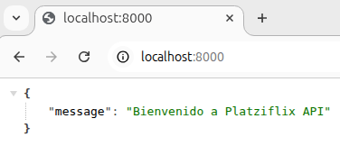
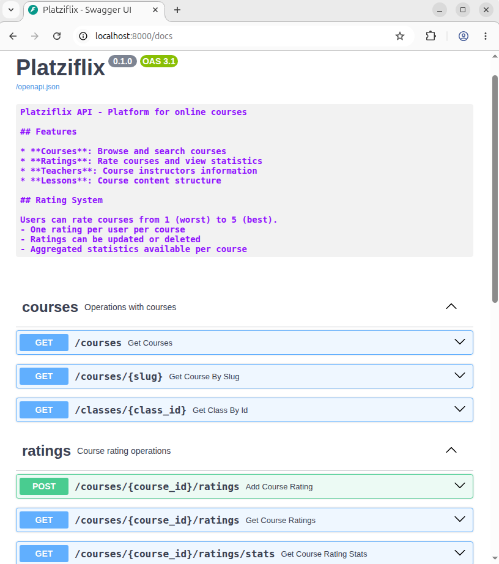
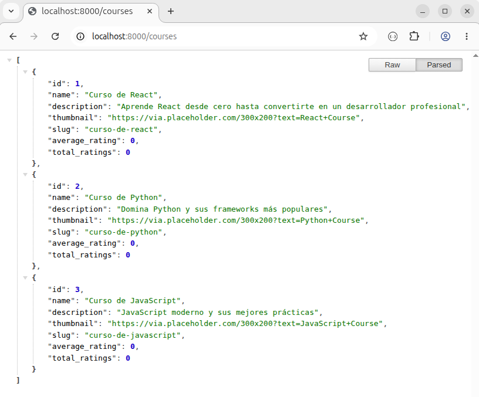

# Listado de Prompts

## Instalación de Docker
1. Ingresar a https://get.docker.com/
2. Ejecutar el script que se indica al inicio del archivo
```shell
cd Download && curl -fsSL https://get.docker.com -o install-docker.sh
sudo sh install-docker.sh
sudo usermod -aG docker [nombre_usuario_linux]  # Define que el usuario tenga permisos para ejecutar el demonio. User: desarrollo.
sudo shutdown -r 0
docker -v
docker version
```

## Instalación de Docker Compose

### Ejecutar Backend
```text
Ahora ayúdame a tener el servicio de @Backend/ corriendo en mi local, verás que ya tengo docker instalado y listo para correr.
```
Claude Code ejecutará los siguientes comandos:
```shell
# Levantar los contenedores en segundo plano.
cd .../Backend && docker compose up -d
# Ejecutar migraciones (creación de la BD y sus tablas)
docker compose exec api bash -c "cd /app && uv run alembic -c app/alembic.ini upgrade head"
# Ejecutar el seed (poblar la BD con datos de prueba)
docker compose exec api bash -c "cd /app && uv run python -m app.db.seed"
```
> Todo listo. El backend está corriendo correctamente.
> - Contenedores: PostgreSQL + API levantados.
> - Migraciones: aplicadas (schema inicial + tabla course_ratings).
> - Datos de prueba: 3 profesores, 3 cursos, 6 lecciones.
> 
> Puedes probar en:
> - http://localhost:8000 — API
> - http://localhost:8000/docs — Swagger UI
> - http://localhost:8000/courses — Lista de cursos
>
> Levantamos el backend de Platziflix con Docker: contenedores corriendo, migraciones aplicadas y datos de prueba cargados. El servicio está listo en localhost:8000. (disable recaps in /config)

### API


### Swagger UI


### Listado de Cursos


## Sistema de Ratings
`/effort high`
```text
Necesito implementar un sistema de ratings en este proyecto, el rating de un curso puede ir desde 1 estrella hasta 5 estrellas. Tu tarea es analizar el impacto que va a tener la implementación de este feature en el proyecto. Analiza qué acciones deben hacerse en cada uno de los componentes del proyecto (backend, frontend) para implementar el rating.
```

### Backend
Indicará que todo el backend ya se encuentra listo y funcionando:
| Capa | Estado | Detalle |
| ---- | ------ | ------- |
| Modelo CourseRating | ✅ | course_id, user_id, rating (1-5), soft deletes |
| Migración Alembic | ✅ | CHECK constraint (1-5), UNIQUE (course_id, user_id) |
| Schemas Pydantic | ✅ | Request/Response/Stats con validación |
| Service Layer | ✅ | UPSERT, UPDATE, soft DELETE, stats agregadas con SQL |
| Endpoints API | ✅ | 6 endpoints REST funcionales |
| Tests | ✅ | 39 passed, 1 skipped |

Los endpoints disponibles son:
```text
POST   /courses/{id}/ratings              # Crear/actualizar (upsert)
GET    /courses/{id}/ratings              # Listar ratings
GET    /courses/{id}/ratings/stats        # Promedio + distribución
GET    /courses/{id}/ratings/user/{uid}   # Rating de un usuario
PUT    /courses/{id}/ratings/{user_id}    # Actualizar rating existente
DELETE /courses/{id}/ratings/{user_id}    # Eliminar (soft delete)
```

### Frontend
Indicará que el frontend está parcialmente implementado ⚠️ 
| Capa | Estado | Detalle |
| ---- | ------ | ------- |
| Tipos TypeScript | ✅ | CourseRating, RatingStats, RatingRequest, type guards |
| Servicio API | ✅ | ratingsApi con todos los métodos |
| Componente StarRating | ✅ | Display readonly con medias estrellas y ARIA |
| Integración en Course card | ✅ | Muestra promedio en la grilla de cursos |
| Componente RatingSection | ❌ | No existe — es lo que falta |
| Integración en página de detalle | ❌ | La página del curso no permite calificar |

El único trabajo pendiente está en el frontend: un componente interactivo `RatingSection` que permita al usuario crear, actualizar o eliminar su calificación en la página de detalle del curso.

Acciones concretas:

1. Crear `RatingSection.tsx` (`src/components/CourseDetail/`) — Client Component que
gestione:
    - Estado local: `userRating`, `isLoading`, `error`, `successMessage`.
    - Al montar: consultar si el usuario ya calificó vía `ratingsApi.getUserRating()`
    - Interacción: llamar a `ratingsApi.createRating()` o `ratingsApi.updateRating()` según corresponda
    - Optimistic update + rollback en error.
    - Feedback visual (loading, error, éxito).
2. Integrar `RatingSection` en la página de detalle del curso — Pasar `courseId` y un `userId` al componente.
3. Deuda técnica identificada: el `userId` está hardcodeado como 1 porque no hay sistema de autenticación. Por ahora se puede mantener así y reemplazarlo cuando llegue el módulo de auth.
4. Tests del `RatingSection` con Vitest + React Testing Library.

Resumen del impacto: El backend no requiere ningún cambio Todo el trabajo restante es 4 tareas de frontend, siendo la principal crear el componente RatingSection. ¿Quieres que proceda a implementarlo?

Resumen de cambios:

1. Bug corregido — `ratingsApi.ts` (línea 143)
La URL de `getUserRating` estaba mal: usaba `/ratings/${userId}` en lugar de `/ratings/user/${userId}`. Sin esta corrección, el componente nunca podría cargar el rating previo del usuario.

2. `RatingSection.tsx `— nuevo componente Client
`src/components/CourseDetail/RatingSection.tsx` — Client Component (`'use client'`) que gestiona:
    - Carga del rating existente del usuario al montar (via `getUserRating`)
    - 5 botones de estrellas interactivos con hover y estado seleccionado
    - Actualización optimista con rollback automático en error
    - Estados de UI: idle → loading → success/error
    - Visualización del promedio actualizado tras calificar

3. `RatingSection.module.scss` — estilos
`src/components/CourseDetail/RatingSection.module.scss` — usa color() directamente sin importar `vars.scss` (auto-importado por Next.js).

4. `CourseDetail.tsx` — integración
Añade `<RatingSection courseId={course.id} userId={1} .../>` debajo de las stats de duración/clases. El `userId={1}` es temporal hasta que exista un sistema de autenticación.

5. `RatingSection.test.tsx` — 12 tests
`src/components/CourseDetail/__tests__/RatingSection.test.tsx` cubre: renderizado, estado inicial del usuario, clic para calificar, estado loading, éxito con actualización de stats, manejo de errores, rollback optimista y comportamiento de hover.

### Verificación de Pruebas de la Funcionalidad
Verification: componente RatingSection interactivo

**Verdict**: PASS

**Claim**: El componente aparece en la página de detalle del curso, permite seleccionar 1-5 estrellas con hover, guarda la calificación al hacer click y actualiza el promedio.

**Method**: Cold start — backend con Docker, frontend con yarn dev, Playwright + Chrome headless.

**Steps**

1. ✅ `GET /course/curso-de-react` → `RatingSection` visible con título "Califica este curso" y 5 estrellas grises vacías.
2. ✅ Hover sobre estrella 3 → las 3 primeras se iluminan en amarillo y aparece el label "3 / 5" en tiempo real.
3. ✅ Click en estrella 4 → actualización optimista inmediata (4 estrellas amarillas, "4 / 5"), luego mensaje "¡Calificación guardada!" en verde y promedio 4.0 (1) al pie.
4. ✅ Estado final idle → mensaje desaparece, selección y promedio permanecen.
5. 🔍 Probe — segundo click en estrella 2 (actualizar rating existente) → upsert exitoso, promedio se actualiza a 2.0, confirmando que el backend hace UPDATE correctamente.

**Findings**

- Fix necesario aplicado: el backend no tenía CORSMiddleware, lo que bloqueaba todas las peticiones del browser desde localhost:3000. Se añadió en main.py y el fix está pendiente de commit.
- ⚠️  "Duración total: NaNh NaNm" — bug pre-existente: el campo `duration` en las clases llega como null o con nombre distinto desde la API. No está relacionado con el rating.
- ⚠️  Nombre del profesor y thumbnail no cargan — también pre-existentes.

Todo funcionando correctamente en el navegador. El sistema de ratings opera de punta a punta:
   
- Hover → estrellas se iluminan en amarillo en tiempo real
- Click → se guarda (upsert), aparece "¡Calificación guardada!" en verde y el promedio se actualiza
- Segundo click → actualiza el rating existente sin error

Se aplicó y publicó un fix adicional en el backend: `CORSMiddleware` en `main.py`, que era necesario para que el navegador pudiera hacer peticiones desde `localhost:3000` a `localhost:8000`.

### E2E
7/7 tests E2E pasando. Resumen de lo que se creó:
- `playwright.config.ts` — configuración con baseURL localhost:3000, Chrome del sistema y screenshots en fallos.
- `e2e/ratings.spec.ts` — 7 tests que cubren el flujo completo:
a. Render del componente con 5 estrellas
b. Hover ilumina estrellas y muestra label
c. Click guarda rating con mensaje de éxito
d. Promedio se actualiza tras calificar
e. Rating persiste al recargar la página
f. Actualizar un rating existente (upsert)
g. Funciona en los 3 cursos disponibles