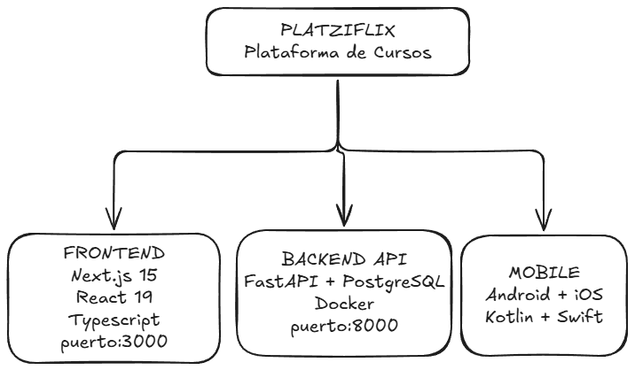

# claude-code
Platzi - Curso de Claude Code

## 📇 Index
- [Big Picture](#big-picture)
- [Backend - FastAPI + PostgreSQL](#backend---fastapi--postgresql)
  - [Arquitectura: Layered Architecture (Service Layer Pattern)](#-arquitectura-layered-architecture-service-layer-pattern)
  - [Endpoints disponibles](#-endpoints-disponibles)
  - [Bases de datos (PostgreSQL 15)](#bases-de-datos-postgresql-15)
- [Frontend - Next.js 15](#frontend---nextjs-15)
  - [Arquitectura: App Router + Server Components](#-arquitectura-app-router--server-components)
  - [Flujo de Datos](#️-flujo-de-datos)
- [Android - Kotlin + Jetpack Compose](#android---kotlin--jetpack-compose)
  - [Arquitectura: Clean Architecture + MVI](#-arquitectura-clean-architecture--mvi)
  - [Patrón MVI](#-patrón-mvi)
- [iOS - Swift + SwiftUI](#ios---swift--swiftui)
  - [Clean Architecture + MVVM](#-clean-architecture--mvvm)
- [Patrones Compartidos en Todo el Sistema](#patrones-compartidos-en-todo-el-sistema)
- [Flujo End-to-End](#flujo-end-to-end)


## 🖼️ Big Picture



## Backend - FastAPI + PostgreSQL
### 🧱 Arquitectura: Layered Architecture (Service Layer Pattern)
```text
📦 app
├── 📄 main.py               ← Endpoints REST (10 rutas).
├── 📄 core/config.py        ← Settings centralizados.
├── 📂 models/               ← SQLAlchemy ORM (entidades con soft deletes).
│   ├── 📄 course.py         ← Course (slug único, M2M teachers, 1-M lessons/ratings).
│   ├── 📄 teacher.py        ← Teacher (email único).
│   ├── 📄 lesson.py         ← Lesson (video_url, slug).
│   ├── 📄 course_rating.py  ← Rating 1-5, unique(course_id, user_id).
├── 📂 schemas/              ← Pydantic DTOs (validación request/response).
├── 📂 services/             ← CourseService (toda la lógica de negocio).
├── 📂 db/                   ← Engine SQLAlchemy + seed
└── 📂 alembic/              ← Migraciones de DB.
```

### 🎯 Endpoints disponibles
| Método | Ruta | Descripción |
| ------ | ---- | ----------- |
| GET | `/courses` | Lista cursos con rating stats |
| GET | `/courses/{slug}` | Detalle con teachers + lessons |
| GET | `/classes/{class_id}` | Detalle de una clase |
| POST | `/courses/{id}/ratings` | Crear/actualizar rating (upsert) |
| GET | `/courses/{id}/ratings/stats` | Promedio + distribución |
| PUT | `/courses/{id}/ratings/{user_id}` | Actualizar rating |
| DELETE | `/courses/{id}/ratings/{user_id}` | Soft delete |
| GET | `/health` | Health check + DB |

### Bases de datos (PostgreSQL 15)
```text
📊 courses -< course_teachers >- teachers
├──< lessons
├──< course_ratings (user_id, rating 1-5, soft delete)
```

## Frontend - Next.js 15
### 🧱 Arquitectura: App Router + Server Components
```text
📂 src/
├── 📂 app/
│   ├── 📄 page.tsx                     ← Home: grid de cursos (SSR).
│   ├── 📄 course/[slug]/page.tsx       ← Detalle del curso.
│   └── 📄 classes/[class_id]/page.tsx  ← Reproductor de video.
├── 📂 components/
│   ├── 📂 Course/                      ← Card con thumbnail + estrellas.
│   ├── 📂 CourseDetail/                ← Vista completa del curso.
│   ├── 📂 StarRating/                  ← Display estrellas (read-only).
│   └── 📂 VideoPlayer/                 ← HTML5 video player.
├── 📄 services/ratingsApi.ts           ← Cliente HTTP para ratings.
└── 📂 types/                           ← TypeScript: Course, Rating, Stats.
```

### ↔️ Flujo de Datos
```text
Next.js Server Component
    ↓ fetch GET /courses
Backend API
    ↓ JSON
Render Course cards → StarRating (average_rating)
    ↓ click
/course/[slug] → fetch GET /courses/{slug}
    ↓
CourseDetail → Lesson list → /classes/[id]
    ↓
VideoPlayer
```

## Android - Kotlin + Jetpack Compose
#### 🧱 Arquitectura: Clean Architecture + MVI
```text
📂 presentation/
├── 📄 viewmodel/CourseListViewModel.kt        ← MVI: handleEvent() + StateFlow.
├── 📄 state/CourseListUiState.kt              ← Estado inmutable.
└── 📄 screen/CourseListScreen.kt              ← Composable UI.

📂 domain/
├── 📄 models/Course.kt                        ← Modelo de dominio.
└── 📄 repositories/CourseRepository.kt        ← Interface (contrato).

📂 data/
├── 📄 network/ApiService.kt                   ← Retrofit interface.
├── 📄 entities/CourseDTO.kt                   ← Respuesta JSON
├── 📄 mappers/CourseMapper.kt                 ← DTO → Domain.
└── 📄 repositories/RemoteCourseRepository.kt  ← Implementación API.
```

#### 🧱 Patrón MVI
```text
UI Event (LoadCourses/Refresh)
   ↓
ViewModel.handleEvent()
   ↓
Repository.getAllCourses() → Retrofit → GET /courses
   ↓
CourseMapper: DTO → Domain
   ↓
UiState(isLoading, courses, error)
   ↓
Composable re-render
```

## iOS - Swift + SwiftUI
#### 🧱 Clean Architecture + MVVM
```text
📂 Presentation/
├── 📄 ViewModels/CourseListViewModel.swift  ← @MainActor ObservableObject
│                                              @Published courses, isLoading,
searchText
└── 📂 Views/
  ├── 📄 CourseListView.swift                 ← Lista + búsqueda con filtrado
  ├── 📄 CourseCardView.swift                 ← Card individual
  └── 📄 DesignSystem.swift                   ← Tokens de diseño

📂 Domain/
├── 📂 Models/ Course, Teacher, Class         ← Identifiable + Equatable
└── 📂 Repositories/CourseRepositoryProtocol  ← Swift Protocol

📂 Data/
├── 📂 Entities/ CourseDTO, TeacherDTO        ← Codable para JSON
├── 📂 Mapper/ CourseMapper, TeacherMapper    ← DTO → Domain
└── 📂 Repositories/RemoteCourseRepository    ← URLSession + async/await

📂 Services/
├── 📄 NetworkManager.swift                   ← URLSession wrapper (singleton)
├── 📄 NetworkError.swift                     ← Error enum tipado
└── 📄 CourseAPIEndpoints.swift               ← Enum de endpoints
```

## Patrones Compartidos en Todo el Sistema
| Patrón | Backend | Frontend | Android | iOS |
| ------ | ------- | -------- | ------- | --- |
| **Repository** | SQLAlchemy + Service | ratingsApi.ts | CourseRepository | CourseRepositoryProtocol |
| **DTOs/Schemas** | Pydantic | TypeScript types | CourseDTO (Kotlin) | CourseDTO (Codable) |
| **Mappers** | implícito en service | - | CourseMapper.kt | CourseMapper.swift |
| **Soft Deletes** | deleted_at en todos | - | - | - |
| **Error Deletes** | HTTP en todos | ApiError | NetworkError | - |
| **Error handling** | HTTP status codes | ApiError class | NetworkError sealed | NetworkError enum |
| **Testing** | pytest | Vitest + RTL | JUnit 4 | XCTest |

## Flujo End-to-End
```text
Usuario abre app/web
        │
        ▼
┌──────────────────┐     GET /courses       ┌─────────────────────┐
│ Frontend/Mobile  │ ─────────────────────► │   FastAPI Backend   │
│                  │                        │                     │
│  Renderiza grid  │ ◄───────────────────── │  CourseService      │
│  de cursos       │   JSON: courses[]      │  → SQLAlchemy       │
│                  │   + avg_rating         │  → PostgreSQL       │
└──────────────────┘   + total_ratings      └─────────────────────┘
        │
        ▼
Usuario selecciona curso
        │
        ▼
GET /courses/{slug} → Detalle completo (teachers, lessons, ratings)
        │
        ▼
Usuario ve lección → GET /classes/{id} → VideoPlayer
        │
        ▼
Usuario puntúa → POST /courses/{id}/ratings → Upsert en DB
```

---
**Resumen de la arquitectura**: Es un sistema Netflix-clone educativo con API REST central (FastAPI) que alimenta tres clientes independientes. Todos usan Repository Pattern como contrato de datos, DTOs con mappers para separar capas, y Clean Architecture en mobile. El backend implementa soft deletes y agregaciones SQL eficientes para rating stats.